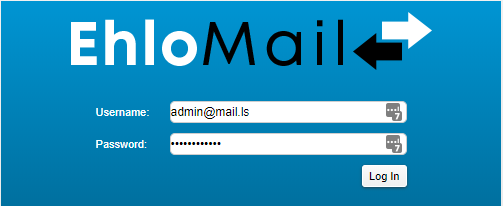

This is where you will be able to create, manage, edit and delete users for the domain you will be managing. An EhloMail administrator account is automatically created when you sign up for the service, with the email address and password you select during the ordering process. 

To access the administration panel navigate to the [EhloMail admin login page](https://mail.ls:9071/admin/) and enter your administrator credentials (remember - the password is the one you selected when purchasing the service):

To create a new email address for the users in your organisation, you will need to go to the home page > **Add account**. 

You will see the maximum number of users the email plan you purchased allows you to create and how many seats are already in use on the next page. Follow the wizard to create a new account. 
The wizard takes you through a series of dialog boxes to set up contact information, features, mail aliases, forwarding information, mailbox preferences, and advanced features, subject to your plan limitations. The minimum account configuration requires completing the Account Name and Last Name fields. The account is created with the default settings from the default COS. 

1.  In the General Information > Account Name section, enter the account name. An account name cannot have spaces or use symbols. You can type a period (.) between words. Example: john.smith. This becomes the name in the email address, i.e. john.smith@example.com

*   Enter the user's name. The  Last name is required.

*   If auto is checked next to the Display name field, the last name is automatically added as the display name. Remove the check mark to create a specific display name.

*   If you do not want this account displayed in the Global Address List (GAL), check Hide in GAL.

1.  In the Account Setup section, leave the Status as Active if the account is going to be immediately available.  If the account is not immediately available, change the account status from Active to Pending.

2.  If auto is checked next to the Class of Service field, the account is assigned the domain COS.  

Remove the check mark from the auto box to select a different COS for the account. In the Class of Service field, enter a few letters of the COS name and then select the COS name from the list that displays.

1.  If using internal authentication, in the Password section, enter a password for this account.  If the user should change the password when the first sign in, check Must change password.

2.  In the Time Zone Setup section, select the time zone for this account.

3.  The Notes section can be used to add a description of this account and to keep notes about the account. The description is displayed with the account information in the account content pane; notes are not displayed.

4.  If this account can use the Voice feature, in the Voice and Chat section, type the voice username and select the service.

5.  Click Next if you want to add contact information, set up aliases and forwarding for this account.  Click Finish if you do not want to make other changes.

6.  If you click Next, in the Contact Information dialog box enter personal information about the user, including. phone numbers, company name, and address information.

7.  In the Aliases dialog box, enter email [aliases](/ehlomail-admin-articles/ehlomail-administration-console/creating-a-domain-alias) for this account.

8.  In the Member of dialog box, add distribution lists this user should be added to.

9.  In the Forwarding dialogs box, [Forwarding](/ehlomail-admin-articles/ehlomail-administration-console/managing-email-addresses/forwarding-mail) is enabled by default. If you do not want this account to forward email messages, remove the check mark from Allow the user to specify a forwarding address.

10.  Features, Preferences, Themes, Zimlets, and Advanced dialog boxes. The default feature, preferences, and advanced features configuration is based on the COS assigned to the account.  You can changes these for individual accounts. A Reset to COS value link is displayed when you make a change to let you know that the account configuration overrides the COS configuration

To view the list of all existing accounts navigate to **Home** > **Manage**. This screen will display their status, the last time they logged in to webmail and any comments you added in the description. 

Right clicking on a user brings up an advanced options menu allowing you to edit, delete or reset the password for an existing account but also create new users directly from this section.
    

Congratulations! You're all setup and ready to manage your organisation's email accounts. For more articles about using the EhloMail features please check the next chapters.
