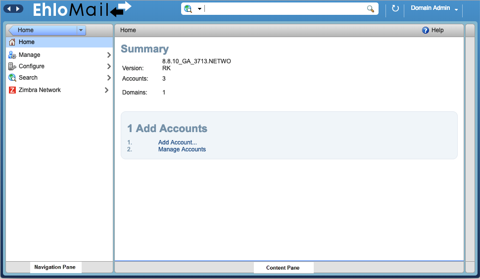

The administration console is used to centrally manage all mail servers and accounts.  From the console you can provision accounts, configure account settings, manage domains etc.

The administration console opens with the Content pane displaying the Home page. The Home page displays links to the most frequently performed tasks.

## Navigation

The administration console is divided into three columns.

*   Navigation pane. The Navigation pane separates functions into following areas.

   *   Home. The Summary column shows the number of accounts, domains and classes of service that have been created; the Maintenance column shows backup status, and the Runtime column shows the number of active sessions and queue length. The frequently performed tasks are linked from this page as well. Also the Help Desk page link is on this page.

    *   Manage. Accounts, aliases, distribution lists and resources pages can be accessed.

    *   Configure. Domain, Zimlets, admin console extensions, certificates, global settings, and voice/chat services pages can be accessed.

    *   Searches. You can create and save searches that you run frequently. Some searches are automatically included on the admin console such as search of all inactive accounts, accounts that are locked out, admin accounts, and closed accounts.

*   Content pane. The Content pane is to the right of the Navigation pane. When you click a function in the Navigation pane, the Content pane changes to reflect that view.

## Managed Components

*   Accounts.  Each account's email address, display name, and status are displayed in the content pane by domain. In Accounts, you create and manage user accounts, change passwords, view an account's mail, and restore an account that has been deleted or corrupted.

*   Aliases.  All aliases for accounts are displayed. In Aliases, you can create and manage user aliases and move aliases.

*   Distribution Lists.  Distribution lists and the status, enabled or disabled, are displayed.  You can create and manage Distribution Lists from here.

*   Resources. Location or equipment that can be scheduled for a meeting are listed. You can create new resources and set the scheduling policy for the resource.

## Configured Components

*   Class of Service. All classes of service (COS) that have been defined are displayed.  As a minimum, the default COS is displayed. You can create and edit COS.

*   Domains. Domains in your EhloMail environment are displayed. You can manage domains, set the GAL mode, virtual hosts, and the authentication mechanism to use for that domain.

*   Admin Extensions. Admin extensions can be deployed and managed from the administration console.

*   Voice/Chat Service.