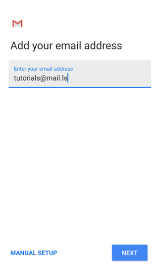

#### Default email client

1. Open your Email app on your Android device
2. **Add Account** > Select **Other**
3. Enter your email address and your password > Tap on **Manual Setup**

4. For the Type of Account, tap on **IMAP**
5. Edit the following details: 
* Server name: mail.ls 
* Port: 993
* Security type: SSL/TLS (Accept all certificates)

6. Tap on **Next** and add the following details for the outbound settings
* SMTP server: mail.ls
* Port: 465
* Security type: SSL/TLS (Accept all certificates)

7. Choose the Sync frequency and whether you wish for the attachments to be automatically downloaded via WiFi or not 
8. Save

Your account is now setup!

#### Gmail (IMAP)

1. **Settings** > **General Settings** > **Add Account **
2. Setup Email > **Other**
3. Enter your email address and tap on **Manual Setup**

4. Under "type of account select **Personal (IMAP)** 

5. Enter your password and "mail.ls" for server name > **Next**

6. Outgoing Server Settings > Enable "**Require sign-in**" > **Next**

7. Choose the **Sync frequency** for your account > **Next**

Your account is now setup!

#### Android mail or Gmail app with Mobile Sync (paid module)

This additional module for mobile sync allows for instant PUSH notifications meaning you will not only be able to send and receive emails through your mobile device, but you will also be able to synchronize every new email, contact and appointment instantly. 

The steps below are very similar for both the default Android email client and the Gmail app. The important thing to note are the incoming / outgoing server settings which need to be configured manually as explained below:

1. **Settings** > **General Settings** > **Add Account** 
2. Setup **Email** > Select **Exchange and Office 365**
3. Enter your email address 
4. Tap on **Manual Setup**

_**Note**: You might be prompted to accept a disclaimer about data collection required for enabling the mobile sync. Please agree to the collection of data in order to proceed to the next step._
5. Under the type of account, select **Exchange** 

6. Fill in your password
7. Enter the server name: mail.ls
8. Port: 443
9. Tap to expand the SSL / TLS section and select **"SSL/TLS (accept all certificates)"**

8. The email client will check the server connection and once this is performed successfully you will be asked to allow remote control of your device so you can control your device from the EhloMail Web Client.
9. Tap OK and choose the sync frequency. 
10. Tap Next to move on to the last step.
11. Here you are able to review all the remote actions that you or your domain administrator, if the case, will be able to perform remotely. 
 
12. To finish the configuration, select **Activate**.  

Your device will now show in the **Connected Devices & Apps** list and in case of the device being compromised, lost or stolen, you will be able to Wipe the data from the device remotely and disconnect your email account to avoid a privacy breach. 

