#### Default Mail App 

1. Open **Mail** > **Add account**
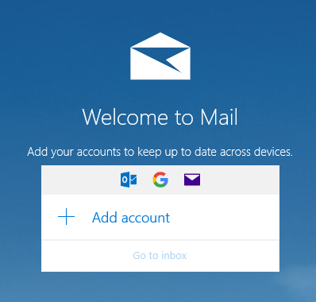
2. Scroll down and select **Advanced setup**
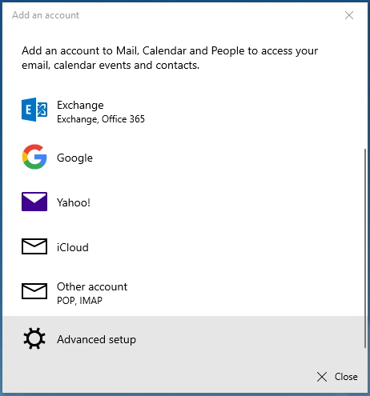
3. Select **Internet email account**
4. Fill in your email address and password and the set the following settings: 
* Incoming email server: **mail.ls**
* Account type: **IMAP (or IMAP4)**
* Outgoing email server: **mail.ls**
* Tick all the boxes for outgoing server authentication, same username and password for email delivery and SSL authentication
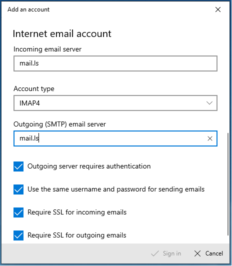
_**Note**: If you've turned on two-step verification for your connected account, you'll need to [create an app password](https://help.mail.ls/email-user-help/email-security/two-factor-authentication-2fa/application-passcode) for this account. Follow the steps in the linked article to create the app password, and then enter that password instead of your original one._
5. **Sign in** 
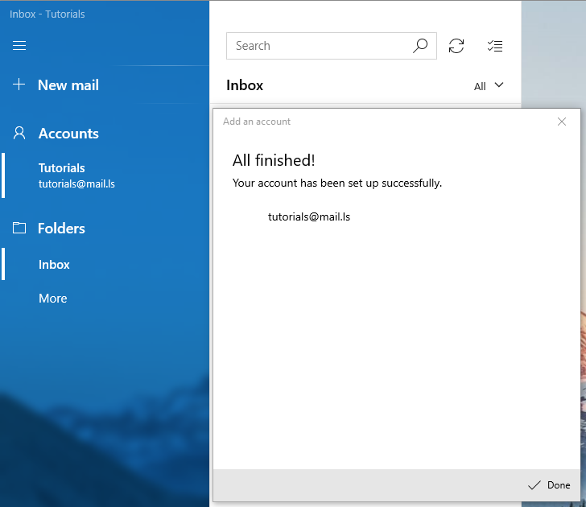

_**Note**: For best experience and access to all EhloMail features we recommend using the [EhloMail Web Client](https://mail.ls)_

### Microsoft Outlook Live

In order to add an external account to your Outlook Live webclient, follow the steps below: 

1. Click on the **Settings** gear > **Settings** > **View all Outlook settings** (should be at the bottom of the page) 
2. In the new window that openes, go to **Email** > **Sync email**.
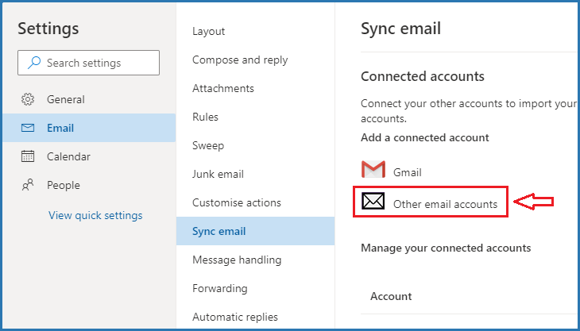
3. Under **Connected accounts**, select **Other email accounts**.
4. On the **Connect your account** page, enter a display name (the name recipients will see when they receive an email message from you) and the full email address and password of the email account you want to connect to your Outlook account.
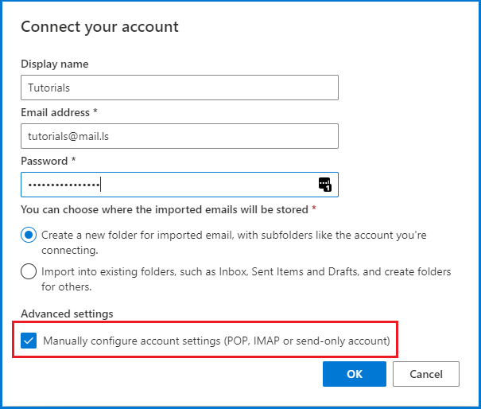
_**Note**: If you've turned on two-step verification for your connected account, you'll need to [create an app password](https://help.mail.ls/email-user-help/email-security/two-factor-authentication-2fa/application-passcode) for this account. Follow the steps in the linked article to create the app password, and then return to Outlook.com to enter that password on the **Connect your account** page._
5. Under **Advanced settings** , select the option to "Manually configure the account settings"
6. Select OK.
7. In the next step, fill in the mail server details as per the screenshot below
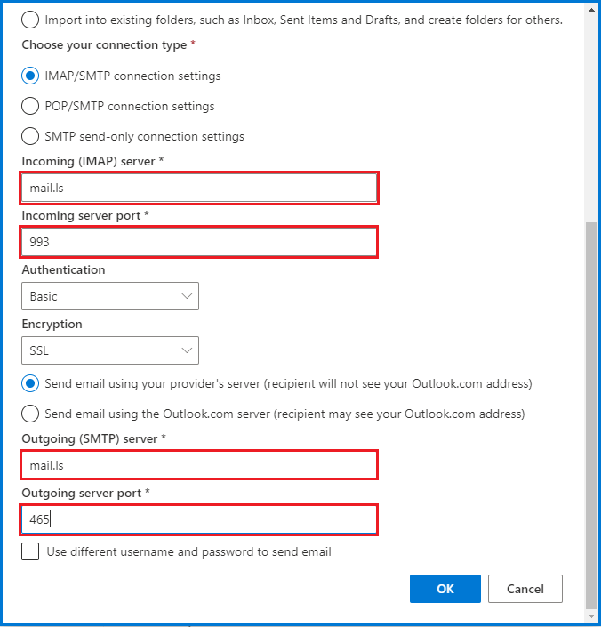
8. Select which email address should be the default one you email from
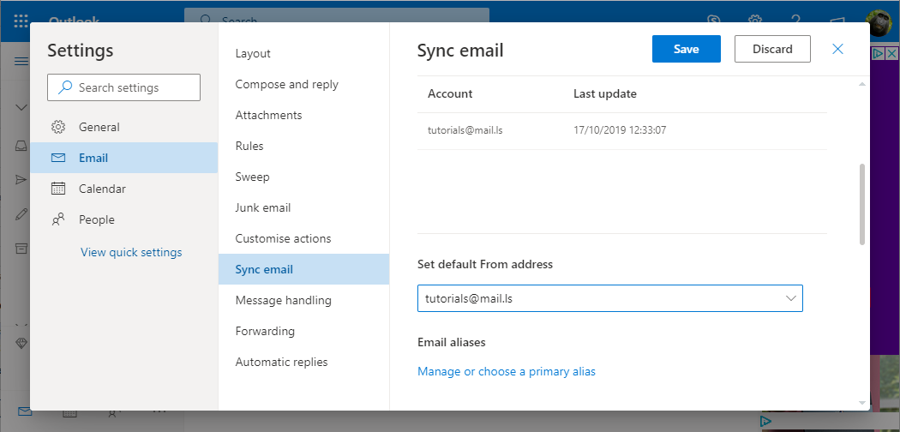
9. Save

### Microsoft Outlook Desktop Client

1. From the search bar on your computer, type in "control panel" and then open it.
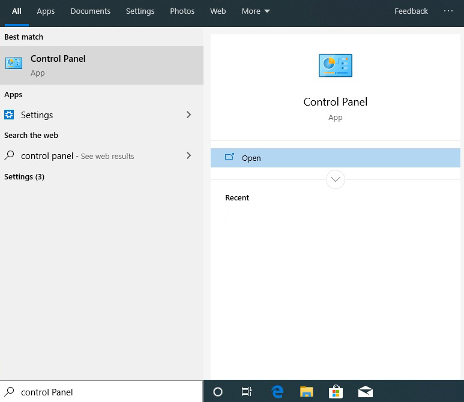
2. Once the control panel is open, go to the search bar and type in '**mail**'. Select the mail icon that is now displayed
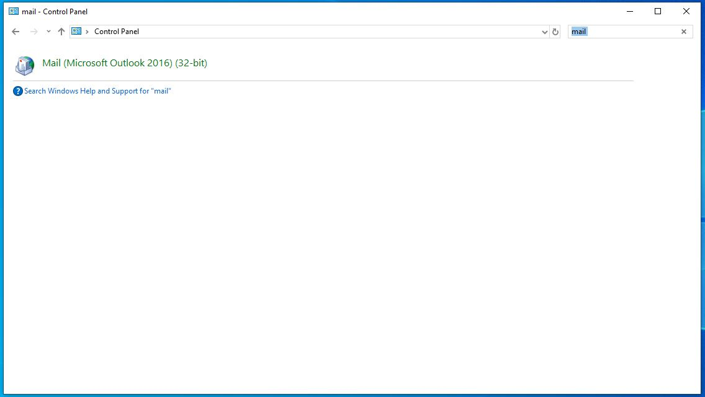
3. The mail setup dialogue box will now open.
4. Click on the **Email Accounts** box
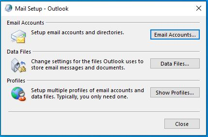
5. A new dialogue box will appear displaying your previous email profile or blank if this is your first email profile.
6. Click on **New**
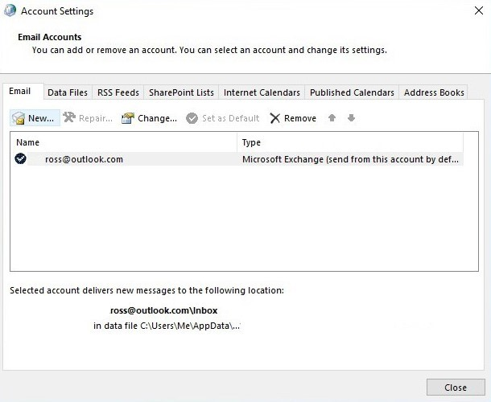
7. You now need to complete the auto-configuration dialogue box.
8. Type in your **Full Name**, your **email address** and then your password twice.
9. Select **Next**
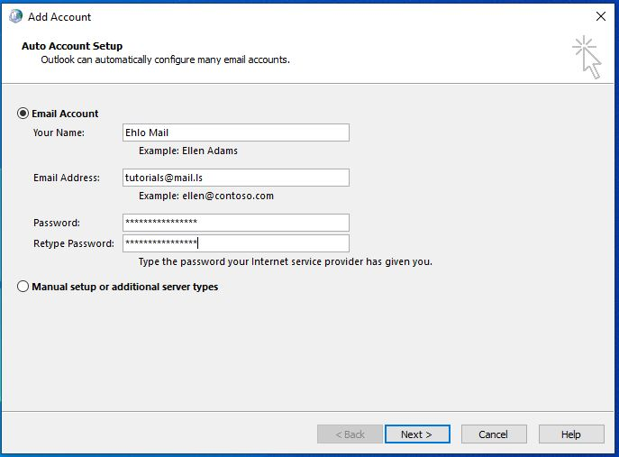
10. Outlook will now query the **EhloMail** server and verify your details and configure your mail profile.
11. Once the process is completed you will see 3 green ticks. You can complete your configuration by clicking on the **finish** button
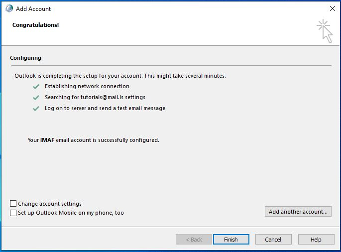
12. Select your new email address and then click on the button to set as default.
13. If this is your first profile you can skip this step.
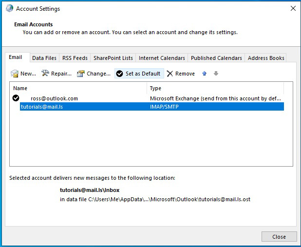
14. Your profile will now be at the top of the list
15. Close the dialogue box
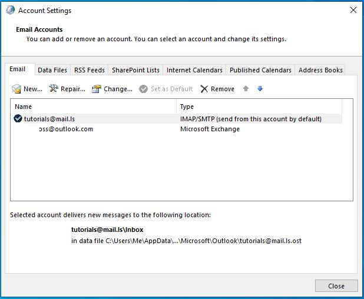
16. Now close the mail setup dialogue box
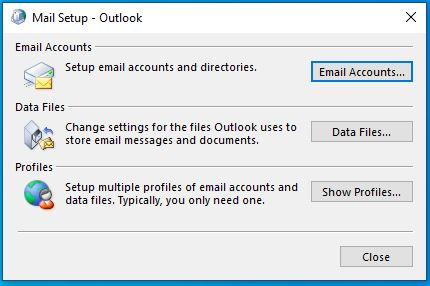
17. You now can open your Outlook client and be automatically connected to your EhloMail server. 