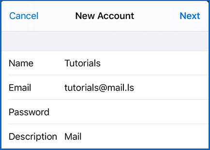
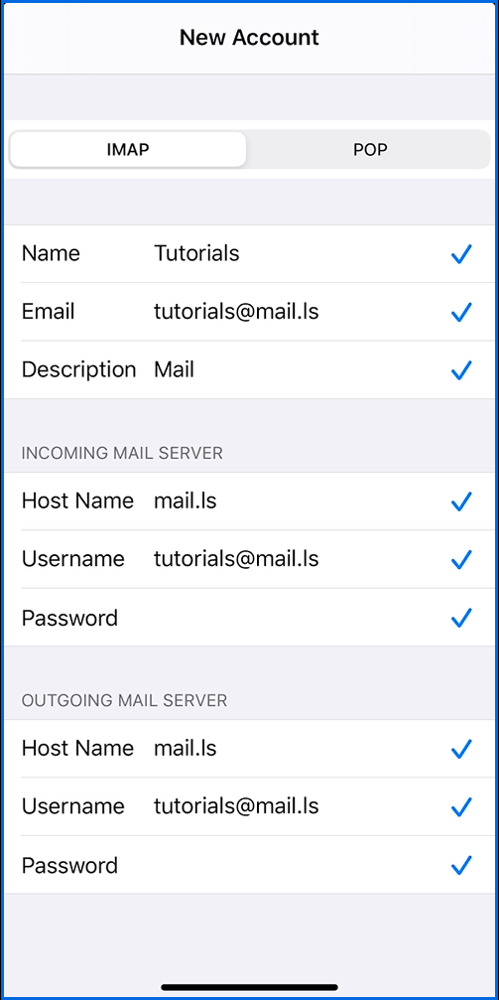
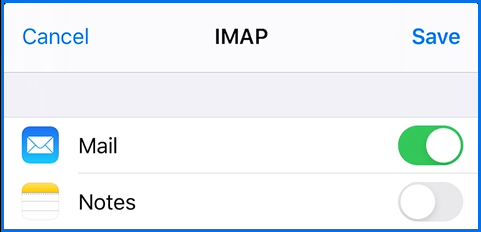

### Setup email on your iPhone, iPad or iPod touch

1. Open **Settings** > **Passwords & Accounts** 
2. Tap on Add Account and select **Other** to **Add Mail Account**
3. Enter your name, email address and the password. You can also add an account description if you wish.

_**Note**: If you've turned on two-step verification for your connected account, you'll need to [create an app password](https://help.mail.ls/email-user-help/email-security/two-factor-authentication-2fa/application-passcode) for this account. Follow the steps in the linked article to create the app password, and then return to your device to enter that password on the New Account configuration page._
4. You will then be prompted to enter the mail server settings. 
5. First make sure you select **IMAP**
6. Fill in the **Incoming and Outgoing Mail** server information as shown in the screenshot

_**Note**: For demonstration purposes the password field has been hidden - you should fill it in yourself on your device._
7. After you double checked that the information is correct, tap **Save** to finish the setup.

