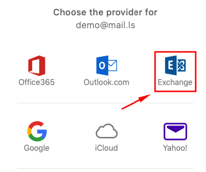
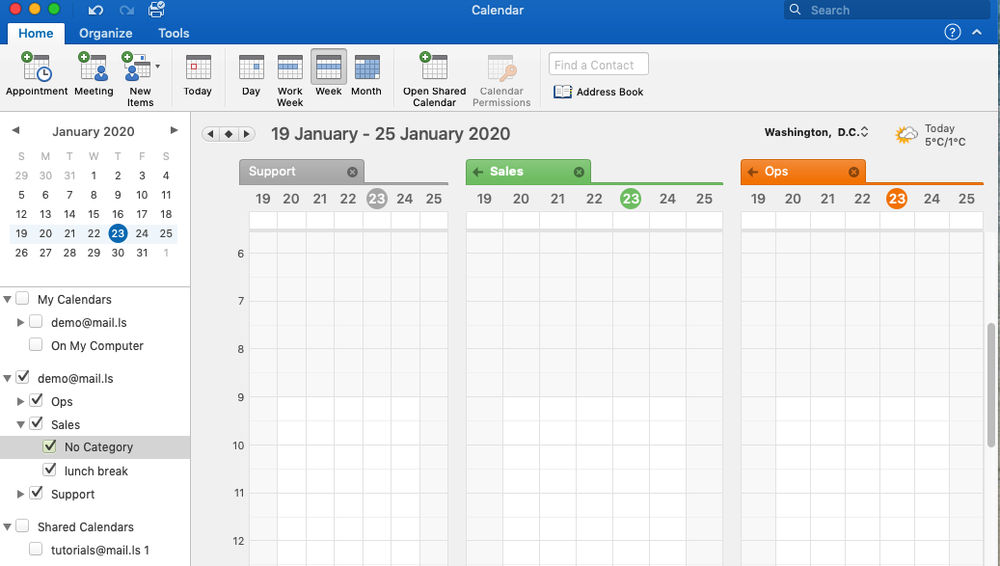

1. Open your Outlook client
2. Click on **Outlook** > **Preferences** and in the new window click on the "+" button in the bottom left handside of the screen
3. **New Account**. 
4. Enter your EhloMail email address 
5. Select **Not IMAP / POP**

6. Pick **Exchange** (some older clients will have Exchange or O365 as an option)

7. Fill in the E-mail address, and the Username and Password. The username will need to be added as domain\username. In our case this will be mail.ls\demo. 

8. Add account
9. That's it! you will now see the other account in the left hand side of the screen. 

10. Outlook will now sync everything in your account: Mail, Contacts, Calendar and Tasks.
