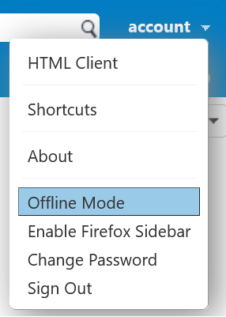
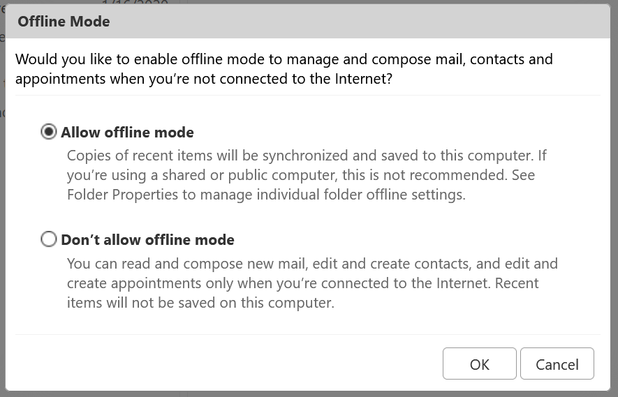
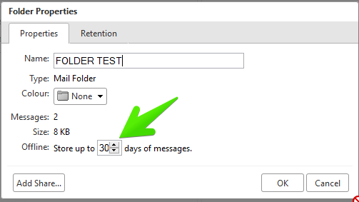

## Offline Mode Features and Functionality 
* No browser plug-ins or extensions are required.
* Uses the same mail URL https://mail.ls which you can browse to even when there is no connection to the server.
* When in online mode and connected to the server, a spinning icon displays in the top right of the screen indicating your data is automatically being synchronized to the server.
* When in offline mode, a disconnected icon displays in the top right of the screen. 
* Any work performed in offline mode is stored in cache, and synchronized with the server when reverted back to online mode.

**Mail**, **Contacts**, **Calendar**, and **Search** applications are supported in offline mode. Tabs such as Community, Tasks, Briefcase and Preferences are not available and are disabled from your view. Other features that are not available include **shared folders** and **Zimlets**.

Signing out of EhloMail turns off the offline mode setting, and will delete any offline data. If you attempt to sign out, a warning displays informing you of this issue.

## Enabling or Disabling Offline Mode
When offline mode is enabled, whenever your machine loses connectivity to the server the EhloMail Web Client will automatically switch to offline mode. If you use another browser or device to access your EhloMail Web Client account, other than the one in which you enabled offline mode, you must enable offline mode again. If you do not want to allow offline mode, you can select to disable the feature.

### Enable Offline Mode
1. In the EhloMail Web Client, click the dropdown menu next to your name in the upper right of the screen.

2. Select Offline Mode.

3. In the Offline Mode dialog, select Allow offline mode and click OK.

4. Accept the warning that displays asking if you want to **reload the application now to enable offline access**? Click Yes.

**Note**: If you don’t reload the application, offline access is available the next time you sign in.

5. The application reloads and a sync icon displays in the upper right of the screen. You are now working in offline mode.

### Selecting How Long to Store Offline Content

By default, if your machine is in offline mode, the last 30 days of your Inbox, Sent, Drafts, and Trash messages are stored in cache. They are then synchronized to the server when your machine reverts to online mode. This setting is configurable. You can select other folders that you want to use for offline access, and the number of days you want your messages to stay in cache. 

If you do not want your messages to synchronize when reverted back to online mode, select 0.

### Configure Offline Storage and other Folders

1. Right click a folder for which you want to configure offline storage.
2. Select Edit Properties.

3. Select the number of days to store messages.

4. Click OK.

## Supported Browsers
Browsers supported for offline mode include:

* Google Chrome
* Mozilla Firefox